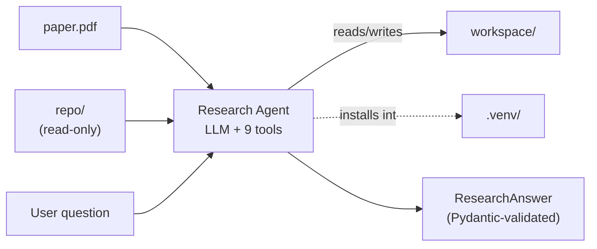
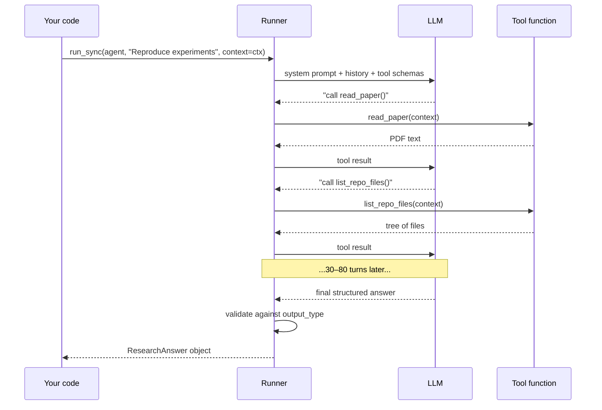
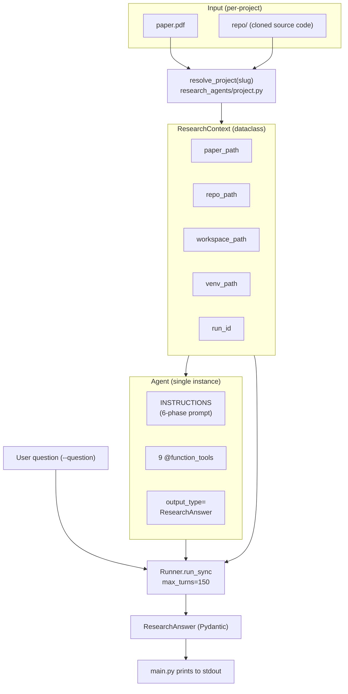
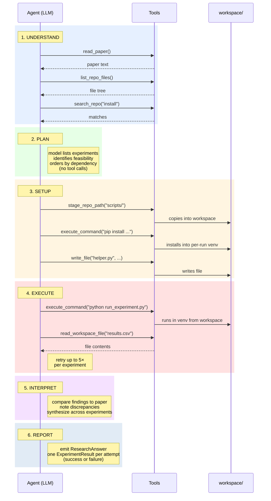
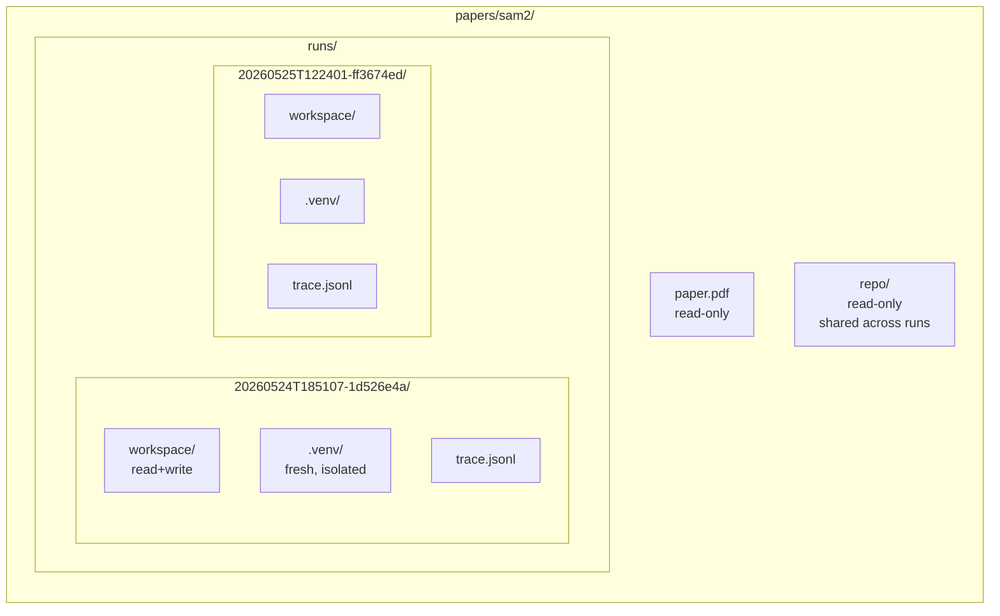
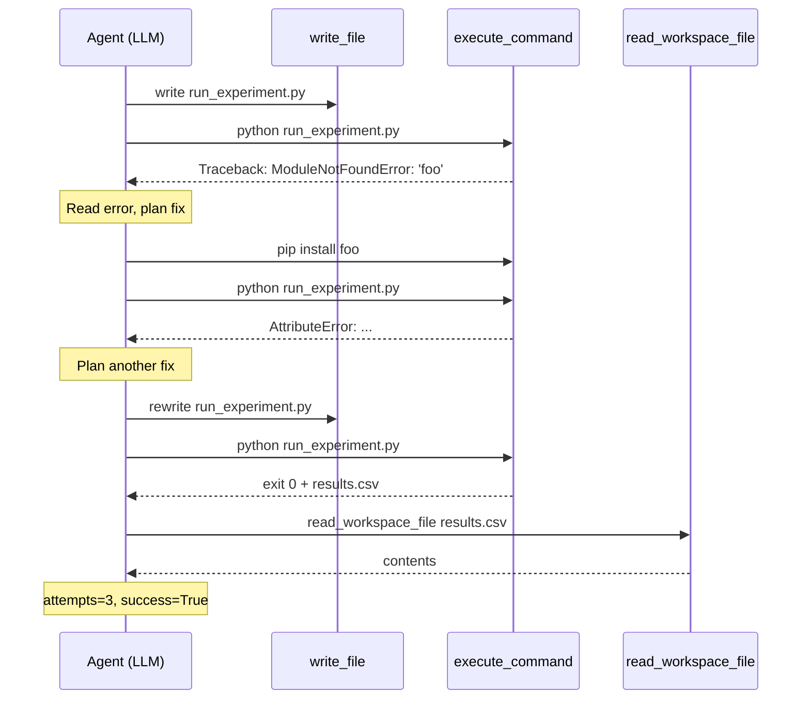
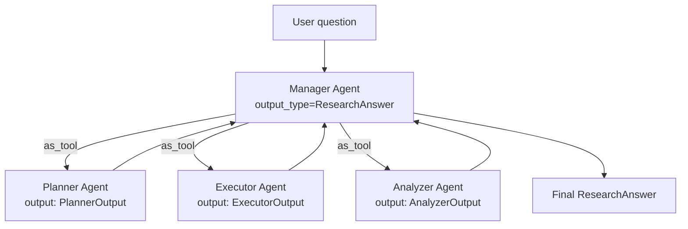
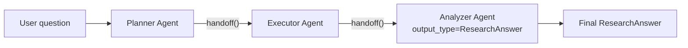
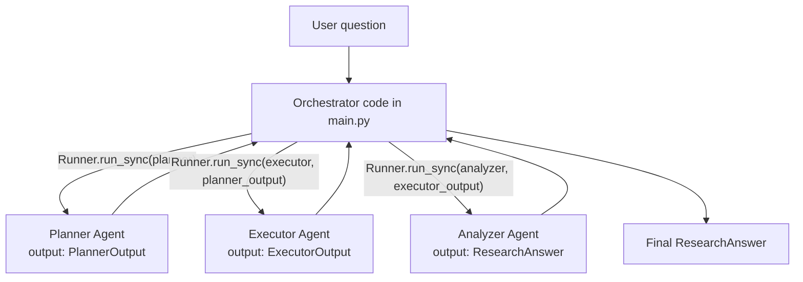

# Research Agents — Architecture Guide

> **Local notes. Not for the tracked repo.** This file lives in `notes/`, which is intended to be gitignored. Snapshot of the project as of 2026-05-25, against `openai-agents 0.17.3`.
>
> If you've been away from the project: skim section 0, then jump to section 6 for the file map. If this is your first read: go top-to-bottom.

---

## 0. The 30-second version

You take a research paper (a PDF) and the codebase that paper describes (a cloned git repo). You point an LLM at both and ask it questions like "reproduce the experiments" or "what's the main contribution?". The LLM has nine specific tools it can use — read the paper, list files in the repo, search the repo, write a script into a sandbox folder, run shell commands, etc. — and it picks them on its own, one tool call at a time, until it has enough information to produce a final structured answer. Every run gets a fresh isolated Python environment so that installing dependencies for paper A doesn't break paper B.

Think of it as hiring a research assistant with five rules:
1. Here's a paper. Here's the source repo for it.
2. You can read anything. You can write only into this scratch folder (`workspace/`).
3. You can install Python packages, but only into your private venv that gets thrown away after the run.
4. When you run shell commands, they always run from your scratch folder.
5. When you're done, fill out this exact form (`ResearchAnswer`) — don't just write me a paragraph.



The framework that drives this loop is the **OpenAI Agents SDK** (`openai-agents` on PyPI). The rest of this guide unpacks both: how the SDK works in general, and how this repo uses it.

---

## 1. The Agents SDK — concepts you need before reading our code

The SDK is in some ways a thin wrapper, but it codifies a few patterns that you don't want to re-invent. If you've been writing LLM apps with raw `openai.ChatCompletions.create(...)` and a hand-rolled while-loop, the SDK collapses 200 lines of plumbing into about 10.

### 1.1 The agent loop

An **agent**, in SDK terms, is just a configured combination of four things:

- A system prompt (the "instructions")
- A set of tools (Python functions the LLM is allowed to call)
- A model name (e.g. `gpt-4.1-mini`)
- *Optionally*, a structured output schema (a Pydantic model)

The SDK's `Runner` then drives a loop. Each turn of the loop looks like this: the LLM sees the conversation so far plus the schema of every tool, and emits either (a) one or more tool calls, or (b) a final answer matching the output schema. If it's tool calls, the SDK executes the corresponding Python functions, feeds the results back into the conversation, and asks the LLM again. If it's a final answer, the SDK validates it against the schema and returns it. The loop repeats until the model produces a final answer, or until a max-turn cap fires (you set this; we use 150).



The thing to internalize: **you never write the loop yourself**. You hand the SDK an `Agent` and an input string, and it hands you back a typed result. Tool dispatching, message formatting, schema validation, retry-on-malformed-output — all SDK responsibility.

### 1.2 The `Agent` constructor — the five things you set

```python
from agents import Agent

agent = Agent(
    name="Research Assistant",
    instructions=SYSTEM_PROMPT,        # str — the system prompt
    tools=[read_paper, search_repo],   # list of @function_tool functions
    model="gpt-4.1-mini-2025-04-14",   # str — the model id
    output_type=ResearchAnswer,        # Pydantic BaseModel; optional
)
```

Five kwargs. None positional. There's a generic type parameter (`Agent[ContextType]`) which lets your IDE know what context type the agent's tools expect — more on that in §1.4.

### 1.3 `Runner.run_sync` — the loop driver

```python
from agents import Runner
from agents.exceptions import MaxTurnsExceeded, ModelRefusalError

try:
    result = Runner.run_sync(
        agent,                  # the Agent instance
        "Reproduce the experiments described in this paper.",  # input str
        context=my_context,     # any Python object you want; opaque to LLM
        max_turns=150,          # int; cap on turns before MaxTurnsExceeded fires
    )
except MaxTurnsExceeded:
    # The agent didn't converge. No final_output.
    ...
except ModelRefusalError as exc:
    # Since SDK 0.15, structured-output refusals raise instead of looping.
    ...

answer: ResearchAnswer = result.final_output  # typed!
```

Three things worth flagging:

- **`run_sync` is synchronous**. There's also an async `run` (and a streaming variant). Sync is fine for batch jobs, slower for interactive UIs.
- **`max_turns` is a *hard* cap**. The SDK raises `MaxTurnsExceeded` when it's hit. It's there to protect against runaway agents (e.g. one stuck in an infinite retry loop on a missing file).
- **The exceptions matter**. Pre-SDK-0.15, a refused completion silently returned an empty string and the loop kept burning turns; now refusals raise immediately. You almost always want to catch both `MaxTurnsExceeded` and `ModelRefusalError`.

### 1.4 `@function_tool` — turning a Python function into a tool the LLM can call

```python
from agents import RunContextWrapper, function_tool

@function_tool
def read_paper(context: RunContextWrapper[ResearchContext]) -> str:
    """Read the local project paper and return its text."""
    paper_path = context.context.paper_path
    return f"Contents of {paper_path}:\n" + extract_pdf_text(str(paper_path))
```

What the decorator does:

1. **Generates a JSON schema** for the function's arguments from the type hints and the docstring. The LLM sees this schema and knows what arguments to pass.
2. **Hides the first arg** (`context: RunContextWrapper[T]`) from the LLM. The LLM never knows it exists. The SDK injects it automatically at call time.
3. **Wires the function into the loop** so that when the LLM emits `{"tool": "read_paper", "args": {}}`, the SDK calls your function with the right context wrapper.

The `RunContextWrapper[T]` is the gateway to per-run state. Whatever object you passed to `Runner.run_sync(... context=X)` becomes `wrapper.context` — note the double access, `context.context.field`. The `T` type parameter is a contract: all tools on the same agent must use the same `T`.

**Why this matters for security**: in this codebase, the `T` is `ResearchContext`, which holds absolute filesystem paths (paper_path, repo_path, workspace_path, venv_path). The LLM never sees those paths. It only sees the *names* of the tools and their arguments. When it calls `read_paper`, the SDK looks up the actual path from the injected context. There's no opportunity for the LLM to ask "read /etc/passwd" via the schema, because the schema doesn't take a path argument at all.

### 1.5 Structured output via `output_type=PydanticModel`

```python
from pydantic import BaseModel, Field

class ExperimentResult(BaseModel):
    name: str
    success: bool
    key_findings: list[str] = Field(default_factory=list)
    # ...

class ResearchAnswer(BaseModel):
    answer: str
    reasoning: str
    experiments: list[ExperimentResult] = Field(default_factory=list)
    # ...

agent = Agent(..., output_type=ResearchAnswer)
result = Runner.run_sync(agent, "...")
# result.final_output is a ResearchAnswer instance — already validated
```

How it works under the hood: the SDK converts the Pydantic model into a JSON Schema and includes it in the model's response-format spec (the newer model APIs natively support strict JSON-schema-constrained generation). When the model produces its final answer, the SDK validates the JSON against the schema and instantiates a Pydantic object. If validation fails — typically because the model emitted an empty or malformed response — the SDK raises (and as of 0.15, model *refusals* on structured outputs raise `ModelRefusalError` instead of looping).

This is enormously cheaper than the alternative ("emit JSON in markdown code fences, parse with regex, hope for the best"). It also makes the post-run code trivial: `result.final_output.answer`, `for exp in result.final_output.experiments: ...`. No defensive `dict.get(...)` everywhere.

### 1.6 Tracing

Every `Runner.run_sync` call produces a tree of **spans** — like OpenTelemetry, scoped to one agent run. The top-level span is the whole run; nested under it are turn spans, tool-call spans, LLM-call spans, and (if you have them) handoff spans. A `TracingProcessor` is a class that gets a callback for every span_start, span_end, trace_start, trace_end event.

The SDK ships a default processor that sends everything to `platform.openai.com/traces` for visualization. You can replace it with your own:

```python
from agents.tracing import TracingProcessor, set_trace_processors

class MyProcessor(TracingProcessor):
    def on_trace_start(self, trace): ...
    def on_trace_end(self, trace): ...
    def on_span_start(self, span): ...
    def on_span_end(self, span): ...
    def shutdown(self): ...
    def force_flush(self): ...

set_trace_processors([MyProcessor()])   # *replaces* default; total override
# or:
# add_trace_processor(MyProcessor())    # adds alongside default (SDK ≥0.15)
```

The choice between `set_trace_processors` (replace) and `add_trace_processor` (additive) matters: replace means the OpenAI dashboard processor goes away. This repo uses *replace* on purpose, because we don't always have an OpenAI dashboard login and we don't want to silently drop traces. The user opts in via `--trace`, which swaps in a local JSONL writer.

### 1.7 Multi-agent primitives (preview)

Single-agent setups are great for ~10 tools and a single coherent task. Past that, you start wanting to *split* responsibilities. The SDK supports three ways to do this:

- **Handoffs**. One agent says "I'm done with my part; pass the conversation to Agent B." Triggered by the LLM emitting a special handoff-tool call. Conversation history transfers; the receiving agent's `output_type` becomes the final output.
- **Agent-as-tool**. Wrap an agent in `.as_tool(...)` and add it to another agent's `tools=[...]`. The outer agent calls the inner agent *the same way it calls any function* — gets back a structured result, keeps control of the conversation.
- **Code-driven (deterministic router)**. Just call `Runner.run_sync` multiple times in sequence from regular Python code, threading outputs through. Most predictable; no LLM-driven orchestration.

Detailed comparison and a recommendation for this project is in §4.

Two things to know now:
- **Lifecycle hooks**: `RunHooks` (`on_agent_start`, `on_tool_start`, `on_handoff`, ...) and `AgentHooks` (per-agent variants) let you observe / mutate the run. We don't use them today.
- **Guardrails**: `@input_guardrail` and `@output_guardrail` are decorators that run validation checks at the run boundaries. `@tool_input_guardrail` / `@tool_output_guardrail` do the same per-tool. We don't use them either; our defenses are inside the tool implementations.

---

## 2. How this repository uses the SDK

### 2.1 The big picture



Read flow: the user invokes `uv run python -m research_agents.main --project papers/sam2 --question '...'`. `resolve_project` validates the project layout and mints a fresh `run_id`, then creates a fresh `.venv/` and `workspace/` under `papers/sam2/runs/<run_id>/`. That `ResearchContext` dataclass is the gateway to all per-run paths. The Agent is built with the system prompt, the 9 tools, the chosen model, and the Pydantic output type. `Runner.run_sync` runs the agent loop, with the context object passed by reference so all tools see the same paths. The result is a `ResearchAnswer` which `main.py` pretty-prints.

### 2.2 The 6-phase workflow

The system prompt (research_agent.py:139-256) directs the agent through six phases. These are not enforced by code — they're enforced by the prompt. The agent is one LLM in one loop; the phase headers are guidance the model is told to follow.



Two invariants the prompt enforces but the schema can't:

1. **Paper-reported numbers are never copied into `key_findings`**. If the agent couldn't run an experiment, it records `success=False` and leaves `key_findings` empty. The agent must report only numbers *it produced itself*.
2. **Failed experiments still get records**. Skipping a failed experiment makes the run look better than it is; the prompt explicitly forbids this.

For read-only questions ("what does this paper contribute?"), the agent short-circuits to phase 6 — answers from the paper text, leaves `experiments=[]`, sets `execution_attempted=False`.

### 2.3 Per-run isolation: the venv-per-run story

The single most project-specific design choice: **every CLI invocation gets its own Python virtual environment**.



The implementation is in [project.py:46-75](../research_agents/project.py):

- `_create_run_id()` mints a sortable ID: `<UTC-timestamp>-<uuid-hex8>` (e.g. `20260525T122401-ff3674ed`).
- `_ensure_venv()` calls `uv venv --seed <path>` which creates the venv and pre-installs `pip` / `setuptools` / `wheel`. The `--seed` flag is what lets the agent's first `pip install` call work without bootstrap steps.
- The venv lives at `papers/<slug>/runs/<run-id>/.venv/`. Each run gets a fresh `<run-id>` → each run gets a fresh `.venv`.

The piece that makes bare `python` and `pip` "just work" inside `execute_command` is the **PATH injection** in [exec_tools.py:171-174](../research_agents/tools/exec_tools.py):

```python
if venv_path is not None:
    venv_bin = str(Path(venv_path).resolve() / "bin")
    env["PATH"] = venv_bin + os.pathsep + env.get("PATH", "")
    env["VIRTUAL_ENV"] = str(Path(venv_path).resolve())
```

The agent writes `python foo.py` or `pip install torch` and the shell resolves those into the run's private venv first. The agent never has to know the absolute path. That's why the system prompt can say "never use system python or pip directly — they are already routed to the project venv."

Why bother with isolation?

- **Cross-paper isolation**: paper A needs `torch 2.0`, paper B needs `torch 2.3`. They can't share a venv without constant conflict.
- **Cross-run isolation**: a botched `pip install` in one attempt doesn't poison the next attempt against the same paper.
- **System hygiene**: the user's system Python is never touched.

### 2.4 The 9 tools, grouped by role

All tools take `RunContextWrapper[ResearchContext]` as their first argument (hidden from the LLM). All return strings (tool output to the LLM). Each tool wraps a pure helper (e.g. `write_file_text`) that takes plain strings/paths so the helpers can be unit-tested without booting the SDK.

**Reading (4)** — used heavily in phases 1–2 (UNDERSTAND, PLAN):

| Tool | File | What it does | Key caps |
|---|---|---|---|
| `read_paper` | [paper_tools.py:46](../research_agents/tools/paper_tools.py) | Extract all text from `paper.pdf` via `pypdf` | unbounded (one PDF) |
| `list_repo_files` | [repo_tools.py:260](../research_agents/tools/repo_tools.py) | List readable text files under `repo/` | `MAX_LISTED_FILES = 400` |
| `search_repo` | [repo_tools.py:266](../research_agents/tools/repo_tools.py) | Case-insensitive grep across readable repo files | `MAX_MATCHES = 50`, line preview `MAX_LINE_LENGTH = 240` |
| `read_repo_file` | [repo_tools.py:276](../research_agents/tools/repo_tools.py) | Read one text file from `repo/` by relative path | `MAX_FILE_BYTES = 200_000` (200 KB) |

**Execution (5)** — used heavily in phases 3–5 (SETUP, EXECUTE, INTERPRET):

| Tool | File | What it does | Key caps |
|---|---|---|---|
| `write_file` | [exec_tools.py:316](../research_agents/tools/exec_tools.py) | Create/overwrite a file in `workspace/` | `MAX_WRITE_BYTES = 500_000` (500 KB) |
| `stage_repo_path` | [exec_tools.py:331](../research_agents/tools/exec_tools.py) | Copy a file or directory from `repo/` into `workspace/` | skips ignored dirs (.git, .venv, ...) |
| `execute_command` | [exec_tools.py:352](../research_agents/tools/exec_tools.py) | Run a shell command from `workspace/` with venv on PATH | `DEFAULT_TIMEOUT = 120`, `MAX_TIMEOUT = 600`, `MAX_OUTPUT_BYTES = 50_000` |
| `list_workspace_files` | [exec_tools.py:396](../research_agents/tools/exec_tools.py) | List files the agent has created in `workspace/` | `MAX_LISTED_FILES = 400` |
| `read_workspace_file` | [exec_tools.py:402](../research_agents/tools/exec_tools.py) | Read a file from `workspace/` (logs, CSVs, JSON, etc.) | `MAX_READ_BYTES = 200_000` |

Design rules enforced by these tools (verified by tests in `tests/test_*_tools.py`):

- **`repo/` is input-only by prompt convention**. Only `stage_repo_path` can copy *out* of it; nothing writes *into* it. The agent prompt forbids writing there. This is not filesystem-enforced — a clever `execute_command` could escape via `cd ..` — but in practice the convention holds.
- **Every path is sandboxed**. Each tool resolves the requested path and asserts `.relative_to(root)` to block traversal. `../../../etc/passwd` raises a clean `ValueError`.
- **Outputs are capped**. `execute_command` truncates stdout/stderr at 50 KB so one noisy log doesn't blow the agent's context. `read_workspace_file` truncates at 200 KB. Truncation is marked in the returned string so the agent knows it happened.

### 2.5 Structured-output schemas

The agent must emit a `ResearchAnswer` ([research_agent.py:101-134](../research_agents/agents/research_agent.py)):

```python
class ResearchAnswer(BaseModel):
    answer: str                                # executive summary
    reasoning: str                             # detailed reasoning
    sources: list[str]                         # paper path + repo/workspace files
    experiments: list[ExperimentResult] = []   # one per attempted experiment
    execution_attempted: bool                  # True iff any shell command was run
    overall_interpretation: str | None = None
    reproducibility_assessment: str | None = None
```

And one `ExperimentResult` per attempted experiment ([research_agent.py:28-99](../research_agents/agents/research_agent.py)):

```python
class ExperimentResult(BaseModel):
    name: str
    paper_reference: str            # e.g. "Section 4.2, Table 1"
    scripts_used: list[str]
    commands_run: list[str]
    success: bool                   # True iff usable results were produced
    key_findings: list[str]         # ONLY numbers the agent produced itself
    output_files: list[str] = []
    interpretation: str             # what the findings mean vs paper claim
    paper_comparison: str | None = None
    error_summary: str | None = None
    attempts: int = 1               # retry count for this experiment
```

The `execution_attempted: bool` field exists for a specific downstream-grading reason: "no code was run because the question didn't need it" vs "code was run and everything failed" both produce empty/all-failing `experiments` lists. The flag disambiguates. Without it, the batch benchmark grader can't tell apart "no execution intended" from "execution attempted but blocked."

### 2.6 Local tracing (the JSONL writer)

[tracing.py:24-94](../research_agents/tracing.py) defines `JsonlFileTraceProcessor(TracingProcessor)`. Each lifecycle hook writes one JSON object per line to `runs/<run-id>/trace.jsonl`:

```python
def on_span_start(self, span: Span[Any]) -> None:
    self._write_line({"event": "span_start", "data": span.export() or {}})
```

Two design choices worth knowing about:

1. **JSONL, not single-doc JSON**. A crashed or interrupted run still leaves a parseable file — everything written up to the crash is already on disk, no closing bracket required. The cost is that consumers must parse line-by-line, but `jq -c` and `for line in open(...)` do that natively.
2. **Open-write-close per line, with a `threading.Lock`**. Sacrifices throughput for durability. At ~hundreds of spans per run the cost is invisible; the simplicity (no buffer, no flush ordering) is worth it. The lock is required because the SDK can deliver span callbacks from worker threads — a torn line would make the whole file unparseable.

The processor is wired in *only* when the user passes `--trace`. Otherwise the SDK's default (OpenAI dashboard) stays put. This is the "we don't always have a dashboard login" pattern.

### 2.7 Runtime budgets, retries, and feedback loops

Two layers of budgeting govern any run: SDK-level (turn cap) and tool-level (per-command timeout, output truncation). Two layers of self-correction: prompt-driven (the LLM retries on its own) and exception-driven (the SDK raises terminal errors).

#### The turn budget

`max_turns=150` ([main.py:77](../research_agents/main.py)) is the only **hard** cap on the run's overall duration. One "turn" = one LLM response + zero or more tool-call invocations resulting from it. Typical runs land in 30–80 turns; 150 leaves headroom for retries on the harder paper-reproduction questions. Overage raises `MaxTurnsExceeded` and we exit non-zero. There is **no separate wall-clock cap** — a run that sleeps in `execute_command` for the full 600s × 150 turns could in theory exhaust ~25 hours, though in practice the LLM doesn't sit on long timeouts unless the prompt drives it to.

#### The per-command timeout

`DEFAULT_TIMEOUT=120, MAX_TIMEOUT=600` ([exec_tools.py:43-49](../research_agents/tools/exec_tools.py)). The agent can pass any `timeout=` integer to `execute_command`; the wrapper clamps it to `MAX_TIMEOUT=600`. On timeout the subprocess is killed and partial stdout/stderr is returned to the LLM with a `Command timed out after Ns:` prefix — the agent sees the partial output and decides whether to retry, narrow the command, or move on. This is **per-command**, not per-run.

#### The retry / feedback loop

The retry behavior is **prompt-driven, not SDK-enforced**. The system prompt at [research_agent.py:191-199](../research_agents/agents/research_agent.py) tells the agent:

> If an experiment fails, read the error carefully, adjust your approach, and retry. You may retry each experiment up to 5 times. After 5 failed attempts on one experiment, record the failure and move on to the next experiment.

In practice this looks like:



The 5-attempt budget is tracked by the agent itself and surfaced in `ExperimentResult.attempts` ([research_agent.py:92-98](../research_agents/agents/research_agent.py)). The SDK has **no awareness** of this number — if the LLM ignores the rule and retries 20 times, the only thing that catches it is `max_turns=150`. The loop is best-effort; it works because the model is reasonably good at counting and following its own constraints.

What we don't have: an **external supervisor** that watches retry counts and forces termination, a **structured error pattern matcher** that classifies failures (transient vs permanent vs gated), or a **handoff to a different model on N failures**. All would be reasonable additions for a more robust system.

#### What we don't configure on the LLM client

We pass `model="gpt-4.1-mini-2025-04-14"` (or the alternate) and nothing else. The OpenAI client's defaults apply:

- **Per-request HTTP timeout**: the OpenAI Python SDK defaults to roughly 600 seconds for the response, with httpx underneath. A model that "thinks for a long time" (e.g., gpt-5-mini with high reasoning effort) can come close to this on hard prompts.
- **Automatic HTTP retries**: the OpenAI client retries transient errors (429 rate-limited, 500 / 502 / 503 / 504, network blips) up to 2 times by default with exponential backoff. We've never seen this matter, but a flaky network would silently consume those retries before surfacing an error to us.
- **Reasoning effort / verbosity** (gpt-5-series only): defaults are `reasoning.effort="none"` and `verbosity="low"` as of SDK 0.16. We don't override either. If we wanted slower-but-stronger reasoning on hard reproductions, we'd pass `model_settings=ModelSettings(reasoning={"effort": "high"})` — a knob we currently don't expose.

#### What's *not* tracked

| Metric | Status | Why it might matter |
|---|---|---|
| **Total tokens per run** | Untracked | The SDK's `RunResult` has a `.usage` field with input/output token counts; `main.py` doesn't read it. Logging this to stderr would cost two lines and give per-paper cost telemetry. |
| **Wall-clock per run** | Untracked | We don't time `Runner.run_sync`. SAM 2 reproductions can run 20+ min; not knowing the distribution makes batch capacity planning guesswork. |
| **Token cost per run** | Implicit | Derivable from `.usage` × the published rate card, but only after we log usage. |
| **Cache hit rate** | Untracked | OpenAI auto-caches identical input prefixes (≥ 1024 tokens). Long system prompts get cached automatically; the SDK's `.usage` exposes `prompt_tokens_details.cached_tokens` but we don't log it. |
| **Number of HTTP requests** | ≈ number of turns | One LLM call per turn (plus retries), so roughly `len(turns) × (1 + transient_retries)`. The trace.jsonl captures one `generation` span per LLM call. |

#### Concurrency

The SDK supports parallel tool calls — when the LLM emits multiple tool calls in one turn, the SDK can run them concurrently if you set `ToolExecutionConfig(max_function_tool_concurrency=N)` (added in SDK 0.16). We don't set this; tools run serially. For the current workflow this is the right default — most turns are dominated by `execute_command`, which mutates `workspace/`, and parallelism over a shared workspace is a recipe for races.

#### Rough cost per run

Back-of-envelope only. For `gpt-4.1-mini-2025-04-14` (input ~$0.40/M, output ~$1.60/M) at ~50 turns × 3–5K input tokens (system prompt + history) + ~500 output tokens per turn, you're looking at roughly **$0.05–$0.20 per run**, dominated by the input side because the conversation history grows. `gpt-5-mini-2025-08-07` is roughly **5–10× more expensive**. SAM 2 reproductions that include a checkpoint download take 10–30 min wall-clock, but the cost is still dominated by tokens, not wall time — most of the wall time is `pip install` or downloads, which don't burn LLM tokens.

#### Summary table

| Budget | Value | Where | Hard or soft? |
|---|---|---|---|
| `max_turns` (overall) | 150 | [main.py:77](../research_agents/main.py) | **Hard** (SDK raises `MaxTurnsExceeded`) |
| Per-command timeout | 120s default, 600s max | [exec_tools.py:43-49](../research_agents/tools/exec_tools.py) | **Hard** (subprocess killed) |
| Output bytes (stdout/stderr) | 50_000 | [exec_tools.py:34](../research_agents/tools/exec_tools.py) | Soft (truncated, agent sees marker) |
| Workspace file read | 200_000 | [exec_tools.py:38](../research_agents/tools/exec_tools.py) | Soft (truncated) |
| Repo file read | 200_000 | [repo_tools.py:76](../research_agents/tools/repo_tools.py) | Hard (rejected before read) |
| Repo file list | 400 entries | [repo_tools.py:82](../research_agents/tools/repo_tools.py) | Soft (capped, count of omitted shown) |
| Experiment retries | 5 per experiment | [research_agent.py:196-199](../research_agents/agents/research_agent.py) (prompt) | **Soft** (LLM-self-enforced; no SDK enforcement) |
| HTTP timeout | OpenAI client default (~600s) | (unset) | Soft (transparent) |
| HTTP retries on 429/5xx | OpenAI client default (~2) | (unset) | Soft (transparent) |
| Token usage logging | — | (not implemented) | None |
| Wall-clock per run | — | (not implemented) | None |
| Tool concurrency | serial (1) | (unset; default) | — |

---

## 3. Are we doing things correctly? (correctness assessment)

Verdict: **yes, the SDK usage is idiomatic and the security model is sound.** The code follows recommended patterns. Some deliberate non-uses, and a few mild frictions that show up only when extending to multi-agent.

### 3.1 SDK patterns we use correctly

| Pattern | Where | Why it's right |
|---|---|---|
| Typed context injection | All 9 tools have `RunContextWrapper[ResearchContext]` as their first arg | The LLM never sees absolute paths; the surface area for path-traversal attacks is minimized |
| Pure helper + thin wrapper | Every tool is a 1-line `@function_tool` wrapper over a pure `*_text(workspace_path, ...)` function | Helpers are unit-testable without booting the SDK; tests over `tempfile.TemporaryDirectory()` give us coverage |
| Structured output via `output_type=` | `Agent(output_type=ResearchAnswer)` | Final answer is a typed Pydantic instance, not regex-parsed JSON |
| Custom `TracingProcessor` | `JsonlFileTraceProcessor` for local JSONL traces | Works without an OpenAI dashboard login; crash-tolerant |
| Explicit `MaxTurnsExceeded` handling | [main.py:78-84](../research_agents/main.py) | Catches runaway agents; non-zero exit so batch harnesses can distinguish |
| Explicit `ModelRefusalError` handling (post-0.15) | [main.py:85-90](../research_agents/main.py) | Avoids the SDK-pre-0.15 anti-pattern of looping until MaxTurnsExceeded on refusal |
| Per-run isolation | Fresh `.venv/` + `workspace/` per run | Cross-paper and cross-run contamination is impossible |
| Bare interpreter routing via PATH | `execute_command` prepends venv `bin/` | Agent writes `python foo.py`, gets the right Python automatically |

### 3.2 SDK features we deliberately don't use (and why that's fine)

| Feature | Status | Why we skip |
|---|---|---|
| Handoffs | Not used | Single agent today; would be the multi-agent migration's first step |
| Agent-as-tool | Not used | Same |
| `RunHooks` / `AgentHooks` | Not used | Tracing already gives us observability; no behavior-modification needed |
| `@input_guardrail` / `@output_guardrail` | Not used | Open input + a strict output schema is enough; no jailbreak vector is exposed |
| `@tool_input_guardrail` / `@tool_output_guardrail` | Not used | Tool-level checks live inside the helpers (path traversal, size caps) |
| `add_trace_processor` | Not used; we use `set_trace_processors` instead | We *want* replacement semantics — `--trace` should silence the dashboard, not add to it |
| `max_turns=None` (unlimited) | Not used; we use `max_turns=150` | The cap is documented as protective against runaway agents; removing it defeats the purpose |
| MCP support | Not used | Our tools are all local Python; no remote tool servers |
| Streaming `Runner.run_streamed` | Not used | Batch jobs don't need streaming UX |

None of these are deficiencies. They're calibrated absences.

### 3.3 Mild anti-patterns / friction (known, not bugs)

| Friction | Where | Why it's not blocking today |
|---|---|---|
| Monolithic system prompt | [research_agent.py:139-256](../research_agents/agents/research_agent.py) (~120 lines, six phases) | Works for one agent; only an issue when splitting into planner/executor/analyzer |
| `ExperimentResult` mixes ownership | [research_agent.py:28-99](../research_agents/agents/research_agent.py) — fields like `commands_run` are executor-owned, `interpretation` / `paper_comparison` are analyzer-owned | One agent fills the whole struct; only an issue at handoff |
| No agent identity in spans | [tracing.py:60-70](../research_agents/tracing.py) — every span has a `trace_id` but no agent label | One agent per run today, so spans are unambiguous by default |
| `execute_command` has no input guardrail | [exec_tools.py:352](../research_agents/tools/exec_tools.py) — accepts any shell string | Trust boundary is "the agent is the user"; we don't need extra hardening for a single-tenant CLI |
| `repo/` write-protection is prompt-only | Agent is told "don't write here", but `cd ../repo && python -c "open(...)"` would escape | Threat model: developer-tenant only; no production hardening needed |

The takeaway: every "friction" is a known limitation calibrated against the current scope. They become real costs only when the architecture grows beyond single-agent.

---

## 4. Multi-agent readiness (forward-looking, no action)

The user said "later, we will try different Multi Agent Architectures." This section maps the territory.

### 4.1 The three orchestration patterns the SDK supports

#### Pattern A — Manager / agent-as-tool



A central manager agent invokes specialists *as tools* — the same way it calls `read_paper`. The manager stays in control of the conversation, synthesizes results, decides the next step. `result.final_output` is the manager's output_type.

**Pick this when**: the natural shape is "one boss, several reports." Easy to debug because the manager's trace shows every delegate call as a tool span. Each specialist is decoupled — easy to add or remove.

#### Pattern B — Handoffs (peer routing)



One agent transfers conversation ownership to another. Triggered by the LLM emitting a handoff-tool call. Conversation history flows through (configurable via `input_filter`); shared `RunContextWrapper[T]` is passed by reference. **The receiving agent's `output_type` wins** — only the last agent's structured output ends up in `result.final_output`.

**Pick this when**: the work is fundamentally sequential and routing itself is a decision the LLM should make (e.g. "is this a billing question or a refund question?"). For a fixed pipeline like planner→executor→analyzer, handoffs are overkill compared to Pattern C.

#### Pattern C — Deterministic router (code-driven)



Plain Python: call `Runner.run_sync` once per agent, thread outputs explicitly. No LLM-driven orchestration; the sequence is hard-coded. Each agent sees only what the previous one returned, no shared conversation history. The `ResearchContext` can still be passed by reference to all of them.

**Pick this when**: you want maximum predictability, want each agent to have a *different* output_type without final-output ambiguity, or want to inject deterministic logic between agents (e.g. validate the planner's output before letting the executor run). Easiest to test. Easiest to reason about cost (you know exactly how many turns each agent gets).

#### Quick comparison

| | Manager | Handoffs | Deterministic |
|---|---|---|---|
| LLM-driven sequencing | yes (manager picks order) | yes (each agent decides next) | no (code picks) |
| Conversation history shared | within manager turn | yes (transfers) | no |
| `result.final_output` is | manager's output_type | last agent's output_type | last agent's output_type |
| Easiest to debug | yes (single trace) | medium | medium (multiple traces) |
| Easiest to test in isolation | medium | hard | yes |
| Friction when paths fixed | medium (manager re-decides) | medium | low |

### 4.2 What's already in our favor

Audit verdict: **~70% multi-agent ready**, blockers are organizational not architectural.

1. **`ResearchContext` is per-run, not per-agent**. All paths (paper, repo, workspace, venv) are bound to the run, not the agent. Any number of agents in the run can read from `context.paper_path` and write to `context.workspace_path` — no refactoring needed. See [project.py:14-29](../research_agents/project.py).
2. **Tool boundaries are already clean and role-aligned**. The four reading tools have no side effects (perfect for a planner). The five execution tools are cleanly grouped (perfect for an executor). Any tool can be passed to any agent's `tools=[...]`. No tool refactoring needed.
3. **Package layout is plural-friendly**. `research_agents/agents/` is already a directory (plural). Adding `planner_agent.py`, `executor_agent.py`, `analyzer_agent.py` next to `research_agent.py` requires only new `__init__.py` exports.

### 4.3 What would need to change before a multi-agent run

1. **Split `INSTRUCTIONS`**. The 6-phase prompt in [research_agent.py:139-256](../research_agents/agents/research_agent.py) is monolithic. Phases 1–3 belong to a planner, 4 to an executor, 5–6 to an analyzer. Either three separate prompt strings, or one shared "ground rules" prefix + three role-specific suffixes.
2. **Split or layer output schemas**. `ExperimentResult.commands_run` is filled by whoever executed; `ExperimentResult.interpretation` is filled by whoever analyzed. Either define intermediate `ExecutorOutput` and `AnalyzerOutput` schemas and have the final agent build a `ResearchAnswer` from them, or have all agents share `ResearchAnswer` and append fields incrementally (Pydantic supports `model_copy(update=...)`).
3. **Label spans by agent**. [tracing.py:24-94](../research_agents/tracing.py) writes spans without agent identity. Either run each agent in a separate `Runner.run_sync` call with its own trace file (`trace_planner.jsonl`, `trace_executor.jsonl`), or modify the processor to inject the current agent's name into the JSONL records.
4. **Expand the CLI**. [main.py:139-163](../research_agents/main.py) takes a single `--model`. A multi-agent setup probably wants `--planner-model`, `--executor-model`, `--analyzer-model` (the planner and executor can usually use the cheaper model; analysis often benefits from `gpt-5-mini`).

### 4.4 The most promising first split (recommendation)

For *this project*, I'd start with **Pattern C — deterministic router**, with a planner→executor→analyzer split:

- **Planner** owns phases 1–3 (UNDERSTAND, PLAN, SETUP). Gets the 4 reading tools + `stage_repo_path` + `write_file` (for helper scripts) + `execute_command` (for `pip install`). Emits a typed `PlannerOutput` with `experiments_to_run: list[ExperimentSpec]` and a list of files staged.
- **Executor** owns phase 4 (EXECUTE). Gets `execute_command`, `write_file`, `list_workspace_files`, `read_workspace_file`. Receives `PlannerOutput` as its initial input. Runs each experiment, retries up to 5×, emits `ExecutorOutput` with partial `ExperimentResult` records (everything but `interpretation` / `paper_comparison`).
- **Analyzer** owns phases 5–6 (INTERPRET, REPORT). Gets the 4 reading tools + `read_workspace_file`. Receives `ExecutorOutput`. Emits the final `ResearchAnswer` with all fields filled.

Why this seam and not others:

- **The phase 3↔4 boundary** is the most data-clean: after SETUP, the workspace is staged and the venv is provisioned. Everything the executor needs is on disk; no shared mental model required.
- **The phase 4↔5 boundary** is also data-clean: the executor produces files and stdout; the analyzer just reads them. No execution capability needed in the analyzer.
- **Pattern C, not handoffs**: the sequence is fixed (it's always planner→executor→analyzer). Letting the LLM decide the order via handoffs adds variance without benefit. Deterministic also means we can deterministically *skip* the executor for read-only questions ("what does this paper contribute?") — the orchestrator checks `PlannerOutput.experiments_to_run` and short-circuits if empty.

What stays the same:
- `ResearchContext` exactly as-is.
- All 9 tools, in their current files.
- The per-run venv/workspace layout.
- `JsonlFileTraceProcessor` (can be reused per-agent if we want separate trace files; otherwise just leaves agent-identity blank).
- The CLI entry point structure (just gains `--planner-model` / `--executor-model` / `--analyzer-model`).

What gets added:
- `research_agents/agents/{planner,executor,analyzer}_agent.py` next to `research_agent.py`.
- New Pydantic schemas: `PlannerOutput`, `ExecutorOutput`. `ResearchAnswer` stays as the final output.
- A small orchestration function in `main.py` (~20 lines) that calls `Runner.run_sync` three times and threads outputs.

What gets retired (eventually, not immediately):
- The single `research_agent.py` becomes "legacy single-agent mode" — kept for comparison runs. Eventually can be deleted once the multi-agent split lands consistently.

---

## 5. Sandbox agents — would they help us? (local-only deep dive)

The SDK introduced **sandbox agents** in v0.14.0 (April 2026) as a separate execution model from the regular `Agent`. The pitch is "modern agents work best when they can operate on real files in a filesystem" — give the agent a workspace, a shell, and the ability to remember things across runs, all behind an isolation boundary. The SDK ships backends for both local (UnixLocal, Docker) and cloud (E2B, Modal, Vercel, Cloudflare) execution.

Per your constraint — everything must run locally except the LLM API call — that rules out four of the six backends. Only **`UnixLocalSandboxClient`** and **`DockerSandboxClient`** are in scope. This section is the honest answer to "would either be useful for this project?"

### 5.1 What `SandboxAgent` is, in two minutes

A `SandboxAgent` is a sibling of `Agent`, not a subclass — it has different constructor kwargs:

```python
from agents import Runner
from agents.sandbox import (
    SandboxAgent, SandboxRunConfig, UnixLocalSandboxClient,
    Manifest, WorkspaceShellCapability, Memory,
)

agent = SandboxAgent(
    name="...",
    instructions="...",
    default_manifest=Manifest(...),    # what files/dirs/git repos go into the workspace
    capabilities=[
        WorkspaceShellCapability(),    # built-in shell tool
        Memory(),                      # opt-in persistent cross-run memory
        # Compaction(), Skills(), Filesystem(), ...
    ],
    # plus the regular tools=[], output_type=, model=, etc. still work
)

result = Runner.run_sync(
    agent,
    input="...",
    config=SandboxRunConfig(sandbox=UnixLocalSandboxClient()),
)
```

Key differences from a regular `Agent`:

- **Built-in "capabilities"** — `WorkspaceShellCapability()`, `Memory()`, `Compaction()`, `Skills()`, `Filesystem()`. These are pre-wired tools the SDK adds for you. Custom `tools=[...]` still work alongside them.
- **A `Manifest`** declaratively specifies what's in the workspace before the run starts (local files, local dirs, git repos). Equivalent to our `stage_repo_path` calls, but declared up-front rather than dynamically.
- **A `SandboxRunConfig`** selects the execution backend — this is where you swap UnixLocal ↔ Docker without changing the agent definition.

Same `Runner.run_sync` interface. Tracing is documented as "unified with SDK spans" (v0.14.0 release note), so our `JsonlFileTraceProcessor` would still see events, though sandbox-specific span types aren't catalogued in the docs.

### 5.2 The two local backends

#### `UnixLocalSandboxClient`

- **What it actually is**: a PTY-based wrapper that runs commands as subprocesses on the host filesystem. The SDK examples (`examples/sandbox/unix_local_pty.py`) describe it as "fastest local iteration on macOS/Linux." No chroot, no Linux namespaces, no container.
- **Isolation it provides**: directory-scoped (the manifest's `base_dir`) plus path-grant enforcement at the SDK layer. Effectively the same kind of isolation our `execute_command` already gives us — *prompt-and-tool-enforced*, not OS-enforced.
- **Setup friction**: zero. No install beyond the base SDK. macOS + Linux only (Windows not documented).
- **Network access**: undocumented in primary sources. Almost certainly inherits the host's network (since it's host subprocess execution), but the SDK docs don't confirm.
- **Honest read**: this is the "move our existing pattern under the sandbox abstraction without actually changing the isolation model" backend. You'd swap our manual `workspace/` + `.venv/` management for a `Manifest` + `WorkspaceShellCapability`, gain the bonus capabilities (Memory, Compaction), and lose nothing in terms of isolation — *because there was nothing extra to lose*.

#### `DockerSandboxClient`

- **What it actually is**: spins up a Docker container per run, runs the agent's shell commands inside it, mounts the manifest's contents into the container. Requires the `openai-agents[docker]` extra.
- **Isolation it provides**: **real OS-level container isolation**. The agent cannot reach host paths outside what's mounted; network access can be controlled at the container level (`--network=none` for fully air-gapped, or open for `pip install`).
- **Setup friction**: needs a running Docker daemon and an image. The SDK docs do not specify a default image, so you'd either ship one (thin Debian/Ubuntu base + Python 3.12 + uv) or write a per-paper `Dockerfile`. On macOS that means Docker Desktop or Colima running in the background.
- **Honest read**: this is the only local backend that would give us *genuinely stronger* isolation than what we have today. A determined `execute_command` escape via `cd ../repo && python -c "open('/etc/passwd')"` — which is possible in our current model — would be blocked.

### 5.3 What we'd gain by adopting `SandboxAgent`

| Gain | UnixLocal | Docker |
|---|---|---|
| OS-level filesystem isolation | No (same as today) | **Yes** |
| OS-level network isolation | No (host network) | **Yes** (`--network=none` available) |
| `Memory()` — persistent cross-run notes | Yes | Yes |
| `Compaction()` — auto-summarize long conversations to fit context | Yes | Yes |
| Snapshot/resume across CLI invocations | Yes (`LocalSnapshotSpec`) | Yes |
| Backend portability (swap executor without code changes) | Yes | Yes |
| Declarative manifest of what's in scope | Yes | Yes |

The two most interesting standalone wins are **`Memory()`** (the agent learns from prior runs against the same paper — e.g. "last time I tried sam2 the Hydra config path was `sam2/configs/...` and that failed; the correct path is `configs/...`") and **`Compaction()`** (long runs that bump against the context window get auto-summarized instead of being truncated). The rest are operational niceties.

### 5.4 What we'd lose / friction we'd take on

- **Operational transparency**. Our current pattern is just `subprocess.run(shell=True, cwd=..., env=...)`. You can read [exec_tools.py:144-247](../research_agents/tools/exec_tools.py) and know exactly what's happening. `SandboxAgent` abstracts that behind a `SandboxClient` interface — debugging "why did this command fail?" goes from `cat trace.jsonl | jq` to reading SDK source code to understand the abstraction layers.
- **Beta surface, still maturing**. The sandbox feature has shipped four security-related fixes in the six weeks since v0.14.0: v0.17.0 (extra_path_grants becomes mandatory, breaking change), v0.17.1 ("limit sandbox archive extraction," "validate git repo subpaths," "constrain local sandbox artifact sources to base dir"), v0.17.3 ("keep mountpoint credentials out of sandbox commands"). This will stabilize, but it isn't there yet — and migrating onto an API surface that just shipped a breaking change is taking on risk.
- **Undocumented behaviors**. Primary sources don't specify: network access from local sandboxes by default, read/write semantics of `extra_path_grants`, performance overhead of sandbox-mediated commands, what sandbox-specific span types appear in the trace. You'd have to read the SDK source to know what you're actually getting.
- **Docker friction (if you pick that backend)**. Need a Docker daemon running. Need to pick or build an image. Need to think about what the image has installed (does it have `git`? `uv`? Python 3.12?). Per-paper images vs one base image? On macOS, Docker runs through a VM (Docker Desktop / Colima), adding latency on every container spin-up.
- **Manifest design overhead**. We currently stage repo contents *dynamically* — `stage_repo_path` is called inside the agent loop when the agent decides it needs a file. With a manifest, you declare up-front what's in the workspace. For exploratory questions where the agent doesn't know yet which files matter, that's a worse fit: you either over-stage (slow, possibly large) or under-stage and have to mutate the manifest mid-run.

### 5.5 Side-by-side: the three models

```mermaid
flowchart TB
    subgraph cur["Today: regular Agent + venv-per-run"]
        direction LR
        C1["execute_command<br/>(custom @function_tool)"] --> C2["subprocess.run(shell=True,<br/>cwd=workspace,<br/>env=venv-on-PATH)"]
        C2 --> C3["Host filesystem<br/>(prompt-enforced sandbox)"]
    end
    subgraph ul["Alt 1: SandboxAgent + UnixLocalSandboxClient"]
        direction LR
        U1["WorkspaceShellCapability"] --> U2["PTY-wrapped subprocess<br/>(SDK-managed)"]
        U2 --> U3["Host filesystem<br/>(Manifest-enforced sandbox)"]
    end
    subgraph dk["Alt 2: SandboxAgent + DockerSandboxClient"]
        direction LR
        D1["WorkspaceShellCapability"] --> D2["docker exec into<br/>per-run container"]
        D2 --> D3["Container filesystem<br/>(OS-enforced isolation)"]
    end
```



| | Today (venv-per-run) | UnixLocal sandbox | Docker sandbox |
|---|---|---|---|
| Filesystem isolation | Prompt-enforced | Manifest-enforced (still host) | **OS-enforced** |
| Network isolation | None | None (inherits host) | Configurable per-container |
| Setup needed | `uv` (already there) | None | Docker daemon + image |
| Per-run startup | ~1 s (`uv venv --seed`) | ~1 s (PTY init) | ~1–3 s (container spin-up) |
| Debuggability | High (plain `subprocess.run`) | Medium (SDK abstraction) | Lower (container layer) |
| Cross-run memory | Manual (parse `runs/*/trace.jsonl`) | `Memory()` capability | `Memory()` capability |
| SDK API stability | Stable (regular `Agent`) | Beta (v0.17 still tightening) | Beta |
| Cloud lock-in risk | None | None | None |

### 5.6 Recommendation for this project

**Don't migrate today.** Two reasons:

1. **UnixLocal doesn't give us anything materially better than what we have**. The isolation model is the same — directory + env scoping, no OS-level boundaries. We'd take on a beta API surface (still receiving security fixes monthly) and abstraction overhead in exchange for two genuinely useful capabilities (`Memory`, `Compaction`) and one operational nicety (snapshots). The `Memory` capability is the most interesting bit, but you could build a poor-man's version yourself by reading prior runs' `trace.jsonl` files from `papers/<slug>/runs/` and stuffing a summary into the system prompt — maybe 30 lines of code, no SDK migration required.
2. **Docker would be a real upgrade for isolation, but the friction isn't justified by the threat model**. Our current threat model is "single-tenant developer machine, no untrusted input besides the paper text and repo files we chose to load." A `cd ../etc` escape is theoretically possible but the agent has no motive (it's not adversarial), and the OS-level isolation Docker provides protects against threats we don't have. If this ever becomes a hosted service ingesting papers from random users, Docker sandbox becomes mandatory — but for now, the venv-per-run model is calibrated correctly.

**What's worth borrowing without migrating**: the `Memory()` capability's *idea* — agents learning from prior runs against the same paper. A from-scratch version: a small helper that reads `papers/<slug>/runs/*/trace.jsonl`, extracts the tool-call sequence and `ExperimentResult.error_summary` fields from the most recent successful run, and prepends a "lessons from prior runs:" block into the system prompt. That gives you ~70% of the Memory benefit with zero SDK churn and full visibility into what's being remembered.

**When to revisit**:

- The project moves to a multi-tenant / hosted setting where untrusted papers might be uploaded → migrate to Docker backend.
- The SDK sandbox surface goes 1.0 stable (it's currently in active stabilization, with security fixes shipping monthly).
- You want to run reproductions inside CI / on a shared build server where the host environment is shared with other jobs → Docker.
- You want to swap to a more powerful executor (e.g., a Linux box with a GPU) without code changes — the backend-swap story is the strongest standalone argument for `SandboxAgent`.

Until then: the venv-per-run model is the right level of abstraction for what this project does.

---

## 6. Quick reference

### 6.1 File map

| File | Lines | What it does |
|---|---|---|
| [`research_agents/main.py`](../research_agents/main.py) | ~170 | CLI entry point; argparse; `Runner.run_sync`; exception handlers; pretty-prints result |
| [`research_agents/config.py`](../research_agents/config.py) | ~27 | Loads `.env`; exposes `OPENAI_API_KEY`, `DEFAULT_MODEL`, `ALTERNATE_MODEL` |
| [`research_agents/project.py`](../research_agents/project.py) | ~120 | `ResearchContext` dataclass; `resolve_project`; `_ensure_venv`; `_create_run_id` |
| [`research_agents/tracing.py`](../research_agents/tracing.py) | ~95 | `JsonlFileTraceProcessor`; `enable_local_tracing` |
| [`research_agents/agents/__init__.py`](../research_agents/agents/__init__.py) | 0 | (Empty; package marker) |
| [`research_agents/agents/research_agent.py`](../research_agents/agents/research_agent.py) | ~280 | `ResearchAnswer`/`ExperimentResult` schemas; `INSTRUCTIONS` (6-phase prompt); `create_research_agent` factory |
| [`research_agents/tools/__init__.py`](../research_agents/tools/__init__.py) | — | (Package marker) |
| [`research_agents/tools/paper_tools.py`](../research_agents/tools/paper_tools.py) | ~55 | `read_paper` + `read_paper_text` helper |
| [`research_agents/tools/repo_tools.py`](../research_agents/tools/repo_tools.py) | ~285 | `list_repo_files`, `search_repo`, `read_repo_file` + helpers; ignored-dir/suffix lists; `MAX_*` constants |
| [`research_agents/tools/exec_tools.py`](../research_agents/tools/exec_tools.py) | ~415 | `write_file`, `stage_repo_path`, `execute_command`, `list_workspace_files`, `read_workspace_file` + helpers; PATH injection; timeout/size caps |
| [`tests/`](../tests/) | 46 tests | Pure-helper tests over tmpdirs; no live LLM calls |

### 6.2 Key constants and their rationale

All `MAX_*` are upper bounds chosen to bound the agent's context-window usage and prevent runaway behavior.

| Constant | Value | Defined in | Why |
|---|---|---|---|
| `MAX_LISTED_FILES` | 400 | repo_tools.py, exec_tools.py | Large monorepos easily have thousands of files; 400 is enough to orient in most research repos. |
| `MAX_FILE_BYTES` | 200_000 | repo_tools.py | 200 KB comfortably covers typical Python/C++/docs while bounding token budget. |
| `MAX_MATCHES` | 50 | repo_tools.py | Grep on common terms (e.g. "import") quickly blows past useful signal. |
| `MAX_LINE_LENGTH` | 240 | repo_tools.py | Fits most single-line code without horizontal scroll. |
| `MAX_WRITE_BYTES` | 500_000 | exec_tools.py | Paper-reproducing helpers are small scripts; >500 KB is usually an LLM hallucinating a dataset inline. |
| `MAX_READ_BYTES` | 200_000 | exec_tools.py | Same as `MAX_FILE_BYTES`; consistent mental model for "readable size." |
| `MAX_OUTPUT_BYTES` | 50_000 | exec_tools.py | Enough for tracebacks; prevents verbose logs from flooding context. |
| `DEFAULT_TIMEOUT` | 120 (sec) | exec_tools.py | Covers most small-scale experiments; catches runaway commands quickly. |
| `MAX_TIMEOUT` | 600 (sec) | exec_tools.py | Generous ceiling for training/downloads without dominating wall-clock. |
| `max_turns` | 150 | main.py | Typical runs land in 30–80 turns; 150 leaves headroom for many retries. |

### 6.3 Common run recipes

Read-only question (no code execution expected):

```bash
uv run python -m research_agents.main \
  --project papers/segma \
  --question "What is the main contribution of this paper?"
```

Reproduce all feasible experiments:

```bash
uv run python -m research_agents.main \
  --project papers/segma \
  --question "Reproduce the experiments described in this paper. Run every feasible script, interpret the results, and compare with the paper."
```

Use the stronger model + local tracing:

```bash
uv run python -m research_agents.main \
  --project papers/sam2 \
  --model gpt-5-mini-2025-08-07 \
  --question "Use sam2.1_hiera_large checkpoint to generate masks on cars.jpg." \
  --trace
```

Run the unit test suite:

```bash
uv run python -m pytest tests/
```

(`python -m` is required because `research_agents/` is not installed; explicit `tests/` prevents pytest from recursing into `papers/<slug>/repo/` and erroring out on missing deps.)

Inspect a local trace:

```bash
ls papers/<slug>/runs/ | sort | tail -1   # find most recent run dir
head papers/<slug>/runs/<run-id>/trace.jsonl | python -m json.tool --json-lines
```

---

*End of guide. Last full read-through: 2026-05-25. If anything in this doc disagrees with the code, the code wins — open the file at the cited line and the truth will be obvious.*
